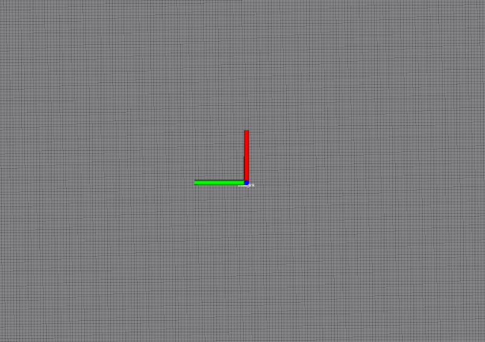

# Planner

一个简单的基于五次多项式的速度规划器

- 主要功能实现在navigation_controller.py，基于当前点（/odom)和目标点 计算一套控制速度序列并发布到/cmd_vel
- test_vitural_joy.py是基于速度话题/cmd_vel计算的仿真里程计，发布odom和path，测试用

## 效果

# 运行

roslaunch planner test_planner.launch